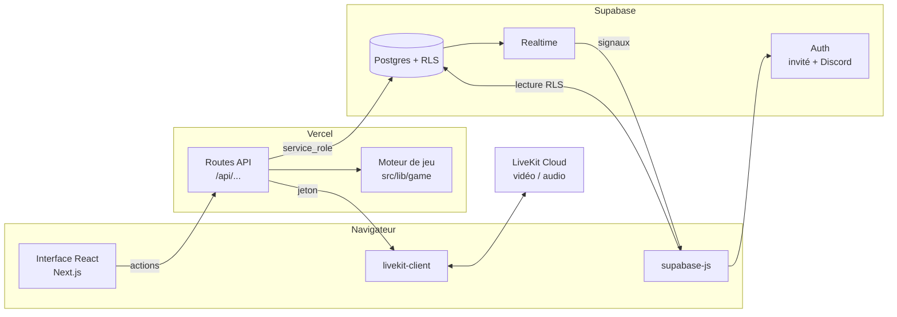
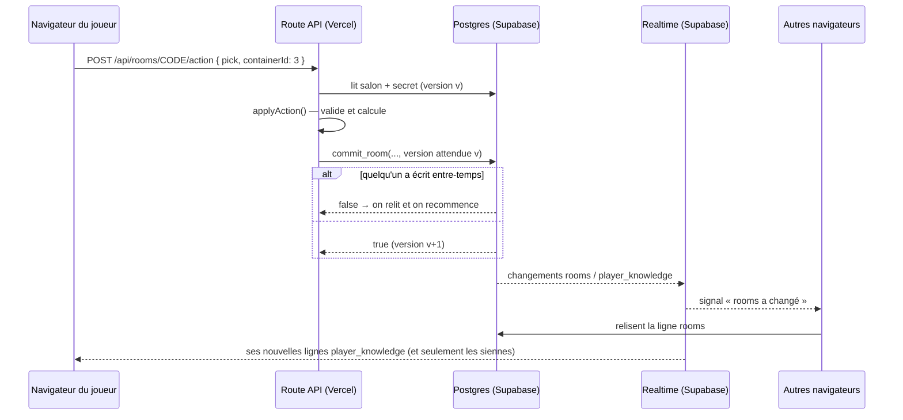

# Architecture

## Vue d'ensemble



- **Vercel** sert le site et les routes API. Comme il ne garde pas de connexion ouverte, le temps réel passe par Supabase Realtime.
- **Les navigateurs ne font que lire** la base (filtrée par la RLS). Toutes les écritures passent par les routes API, qui utilisent la clé `service_role`.
- **Le moteur de jeu** est une fonction pure : `applyAction(état, secret, action, contexte)` renvoie le nouvel état, le nouveau secret et les infos privées à distribuer.

## Organisation du code

```
src/
  app/                    Pages et routes (App Router Next.js 16)
    page.tsx, HomeClient   Accueil : créer, rejoindre, parties publiques
    r/[code]/              Salon (lobby + partie)
    demo/                  Mode solo contre des bots
    auth/callback/         Retour de la connexion Discord
    regles/, mentions-legales/
    api/                   Routes serveur (voir api.md)
  lib/
    game/                  Moteur (types, règles, lots, réglages, bots) + tests
    server/                Accès Supabase serveur, chargement/écriture des salons
    client/                Client Supabase navigateur, synchro temps réel, mode démo
    identity.ts            Pseudo + avatar à partir d'un compte Supabase
    legal.ts               Textes légaux
  components/
    art/                   Ciel, nuages, conteneurs, logo (SVG)
    game/                  Écran géant, conteneurs, dock du décideur, reveal, résultats
    lobby/                 Salon d'attente et réglages
    chat/, media/, auth/, ui/, room/
supabase/
  migrations/0001_dcds.sql Tables, RLS, fonctions SQL, publication temps réel
  tests/rls.test.mjs       Test de la migration et de la sécurité (PGlite)
```

## Modèle de données

| Table | Contenu | Lisible par |
| --- | --- | --- |
| `rooms` | Code, host, statut (`lobby` / `playing` / `finished`), réglages, **état public** de la partie (JSON), `version`, `members_rev` | Membres du salon |
| `room_secrets` | Contenu des conteneurs de la manche, lots déjà tirés | Personne côté client |
| `room_members` | Membres, pseudo, avatar, rôle (`player` / `spectator`) | Membres du salon |
| `player_knowledge` | « Le joueur X a vu le lot Y dans le conteneur Z à la manche N » | Le joueur X uniquement |
| `messages` | Chat, avec `audience` (null = tout le salon, sinon liste des destinataires) | Membres présents dans `audience` |

L'état public (`rooms.state`, type `GameState` dans `src/lib/game/types.ts`) contient tout ce qui est visible par tous : phase, joueurs, décideur, propriétaires des conteneurs, qui a vu quoi, jokers utilisés, scores, journal. Les lots n'y apparaissent qu'une fois révélés.

## Déroulé d'une action



**Verrouillage optimiste.** `commit_room` n'écrit que si `version` n'a pas bougé depuis la lecture. Sinon, la route relit et rejoue l'action (jusqu'à 8 fois). C'est ce qui garantit le « premier arrivé, premier servi » sans verrou long. La logique est dans `mutateRoom` (`src/lib/server/rooms.ts`).

**Signal plutôt que contenu.** À chaque événement temps réel sur `rooms`, le client relit la ligne au lieu d'utiliser le contenu de l'événement : ainsi un état volumineux ou partiellement transmis ne pose jamais de problème. Un rechargement de secours a aussi lieu toutes les 15 secondes et au retour sur l'onglet (`src/lib/client/useOnlineRoom.ts`).

**Présence.** Le statut en ligne / hors ligne des joueurs utilise Supabase Presence sur le canal du salon.

## Une seule interface, deux sources

L'interface ne connaît qu'un objet `RoomView` (`src/lib/client/roomView.ts`) : état, membres, mes infos secrètes, messages, plus les fonctions `gameAction`, `roomAction` et `sendChat`. Deux implémentations le fournissent :

- `useOnlineRoom` : Supabase et les routes API (vraie partie) ;
- `useDemoRoom` : le moteur tourne dans le navigateur, des bots jouent les autres joueurs (`src/lib/game/bots.ts`).

De même, les médias passent par un contexte commun (`src/components/media/MediaContext.tsx`), fourni par `LiveKitMedia` en ligne ou par `DemoMedia` (webcam locale) en démo.

## Vidéo et audio

- La route `/api/livekit/token` délivre un jeton LiveKit valable 6 h pour la salle `dcds-<id du salon>`.
- Seuls les **joueurs** peuvent publier, et seulement les sources autorisées par l'host (caméra et/ou micro). Les spectateurs regardent sans publier.
- Si l'host coupe vidéo et micros, aucune connexion LiveKit n'est ouverte.
- L'écran géant montre le joueur « en vedette » (`spotlightId` dans `src/lib/game/selectors.ts`) ; le reveal ajoute la bande de toutes les caméras.

## Choix techniques notables

- **Next.js 16** avec `cacheComponents` : les pages qui lisent l'URL côté client (`useParams`, `useSearchParams`) sont enveloppées dans `<Suspense>`, sinon le build échoue.
- **Tailwind CSS 4** : les classes maison sont dans `@layer components`, pour que les utilitaires Tailwind (`fixed`, `hidden`…) gardent la priorité.
- **Fenêtres modales via portail** sur `<body>` (`src/components/ui/Modal.tsx`) : les cartes « clay » créent un contexte d'empilement qui piégerait sinon les modales.
- **Pas de cron** : le temps limité est géré « paresseusement » (un client signale l'expiration et le serveur vérifie l'heure).
