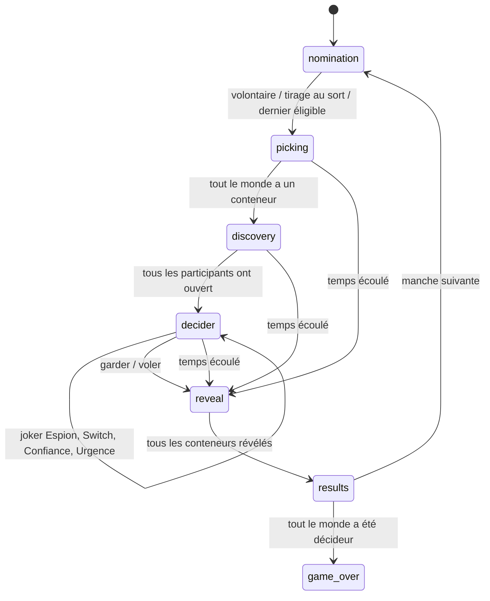

# Règles du jeu (telles que le code les applique)

Le moteur est dans [`src/lib/game/engine.ts`](../src/lib/game/engine.ts). Il est purement logique : pas de réseau, pas d'affichage. Le même code tourne sur le serveur (partie en ligne) et dans le navigateur (mode démo).

## Vocabulaire

- **Partie** : autant de manches que de joueurs, pour que chacun soit décideur une fois.
- **Manche** : nomination, choix, découverte, phase du décideur, reveal, résultats.
- **Décideur** : le joueur qui ne voit pas son conteneur et dispose des jokers.
- **Participants** : tous les autres joueurs de la manche.
- **Spectateurs** : membres du salon qui ne jouent pas (arrivés en cours de partie, ou qui ont choisi de regarder).

## Les phases

### 1. Nomination (`nomination`)
- Tout joueur qui n'a pas encore été décideur peut cliquer « Je me porte volontaire » : le premier qui clique l'emporte.
- L'host peut lancer un **tirage au sort** parmi les joueurs éligibles.
- S'il ne reste qu'un joueur éligible, il est désigné automatiquement.
- Une fois le décideur connu, le serveur tire les lots et les place secrètement dans les conteneurs.

### 2. Choix des conteneurs (`picking`)
- Il y a autant de conteneurs que de joueurs, numérotés et colorés.
- Le **décideur choisit en premier**. Les participants ne peuvent pas cliquer avant.
- Ensuite c'est **premier arrivé, premier servi**. Si deux joueurs cliquent sur le même conteneur, le serveur ne valide que le premier ; l'autre voit « Trop tard ».
- L'ordre de choix des participants détermine l'ordre de découverte.

### 3. Découverte (`discovery`)
- Chaque participant, à son tour, apparaît sur l'**écran géant**, clique « Ouvrir », découvre son lot (lui seul le voit), réagit, puis clique « J'ai fini ».
- Tout le monde voit qui a vu quel conteneur (« Vu par »).
- Le décideur ne voit jamais le contenu de son propre conteneur.

### 4. Phase du décideur (`decider`)
Le décideur peut utiliser ses jokers dans l'ordre qu'il veut. Chacun sert **une fois par manche** ; le conteneur d'urgence sert **une fois par partie**.

| Joker | Effet | Qui découvre quoi |
| --- | --- | --- |
| **Confiance** | Un participant regarde le conteneur du décideur. | Le participant choisi. Sa réaction passe sur l'écran géant. |
| **Switch** | Échange les conteneurs de deux participants. | Chacun des deux découvre son nouveau conteneur, l'un après l'autre. |
| **Espion** | Un participant regarde le conteneur d'un autre participant (ni le sien, ni celui du décideur). | L'espion, qui peut mentir, dire la vérité ou rester neutre. |
| **Conteneur d'urgence** | Le décideur échange son conteneur contre le conteneur d'urgence, au contenu tiré au hasard à ce moment-là. L'ancien conteneur est « abandonné ». | Personne. |
| **Vol** | Le décideur échange son conteneur avec celui d'un participant. **Termine la manche.** | Personne, on passe au reveal. |

- Pendant qu'un joker est en cours (quelqu'un regarde un conteneur), le décideur doit attendre la fin avant d'en jouer un autre.
- À tout moment, le décideur peut cliquer « **Je garde mon conteneur** » : on passe au reveal.
- L'host peut activer ou désactiver chaque joker avant la partie.

### 5. Reveal (`reveal`)
- Le décideur, ou l'host, ouvre les conteneurs un par un, devant tout le monde.
- Ordre : les participants (dans l'ordre des places), puis le conteneur abandonné s'il existe, puis **le décideur en dernier**.
- Toutes les caméras s'affichent en petit en bas de l'écran.

### 6. Résultats (`results`)
- Chaque joueur ajoute à son butin la valeur (fictive, en €) du lot qu'il possède.
- On affiche le classement de la manche et le classement général.
- Le décideur ou l'host lance la manche suivante. Quand tout le monde a été décideur, c'est la **fin de partie** (podium et butin de chacun).

## Temps limité

Si l'host a choisi 3, 5, 10 ou 15 minutes, le chrono démarre quand le décideur est désigné. À zéro :
1. les conteneurs pas encore choisis sont attribués au hasard (décideur d'abord) ;
2. le joker en cours, s'il y en a un, est interrompu ;
3. on passe au reveal (raison affichée : « Temps écoulé »).

## Pouvoirs de l'host

- Avant la partie : tous les réglages, expulser un joueur (il ne peut plus revenir), donner le rôle d'host à quelqu'un d'autre.
- Pendant la partie, via le menu ☰ :
  - **Forcer la suite** : débloque la partie si quelqu'un ne répond plus. Selon la phase, cela tire le décideur au sort, attribue les conteneurs restants, passe le tour du joueur bloqué, écourte le joker en cours, verrouille le choix du décideur, révèle le conteneur suivant ou lance la manche suivante.
  - **Retour au salon** : arrête la partie.
- Si l'host quitte le salon, le rôle passe automatiquement au joueur arrivé le plus tôt.

## Les lots

- **Catalogue** : environ 70 lots dans [`src/lib/game/lots.ts`](../src/lib/game/lots.ts), répartis en 5 raretés : Ultra nul, Bof, Sympa, Trop bien, Légendaire.
- **Tirage** : à chaque manche, au moins un lot « Ultra nul » et au moins un lot « Trop bien » ou « Légendaire » (si le pool le permet). Le reste est tiré au hasard, pondéré par rareté. Un lot ne ressort pas dans la même partie tant qu'il en reste d'autres.
- **Lots de l'host** : en mode « Mes lots » ou « Les deux », l'host ajoute ses propres lots (emoji, nom, rareté ; la valeur découle de la rareté). S'il y en a moins que de conteneurs, certains reviennent plusieurs fois.
